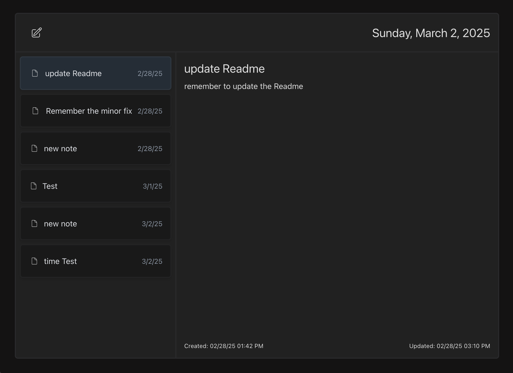

# Project Description

This project is a React application built with TypeScript and Vite. Tailwind for styling and toast for error modals. I tried to limit the files to the main 3, so some choices were made in service to that. It took about 7-8 hours over a few days. I just noticed the video after completing this. The browser I was using must've blocked it. I copied the Assessment Overview and worked off that. I going to put some more time getting a bit closer to the video.


# Screenshots



# React + TypeScript + Vite

This template provides a minimal setup to get React working in Vite with HMR and some ESLint rules.

## How to Run the Application

To run the application, follow these steps:

1. Clone the repository to your local machine.
2. Install the dependencies by running `npm install` or `yarn install` in the project directory.
3. Start the development server by running `npm run dev` or `yarn dev`.
4. Open your web browser and navigate to `http://localhost:5173` to view the application.

## Adding an Environment File

To add an environment file, create a new file named `.env` in the project root directory. This file will contain environment-specific variables that can be used in the application.

To add a company ID variable, for example, you can add the following line to the `.env` file:

```
VITE_COMPANY_ID=your_company_id
```

Replace `your_company_id` with the actual company ID.

To use this variable in the application, you can import it in your React components like this:

```typescript
import { VITE_COMPANY_ID } from '../.env';

const companyId = VITE_COMPANY_ID;
```

Note: Make sure to add the `.env` file to your `.gitignore` file to prevent it from being committed to the repository.

## Expanding the ESLint Configuration

If you are developing a production application, we recommend updating the configuration to enable type aware lint rules:

- Configure the top-level `parserOptions` property like this:

```js
export default tseslint.config({
  languageOptions: {
    // other options...
    parserOptions: {
      project: ['./tsconfig.node.json', './tsconfig.app.json'],
      tsconfigRootDir: import.meta.dirname,
    },
  },
})
```

- Replace `tseslint.configs.recommended` to `tseslint.configs.recommendedTypeChecked` or `tseslint.configs.strictTypeChecked`
- Optionally add `...tseslint.configs.stylisticTypeChecked`
- Install [eslint-plugin-react](https://github.com/jsx-eslint/eslint-plugin-react) and update the config:

```js
// eslint.config.js
import react from 'eslint-plugin-react'

export default tseslint.config({
  // Set the react version
  settings: { react: { version: '18.3' } },
  plugins: {
    // Add the react plugin
    react,
  },
  rules: {
    // other rules...
    // Enable its recommended rules
    ...react.configs.recommended.rules,
    ...react.configs['jsx-runtime'].rules,
  },
})
```
